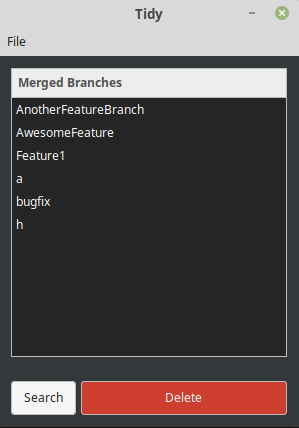
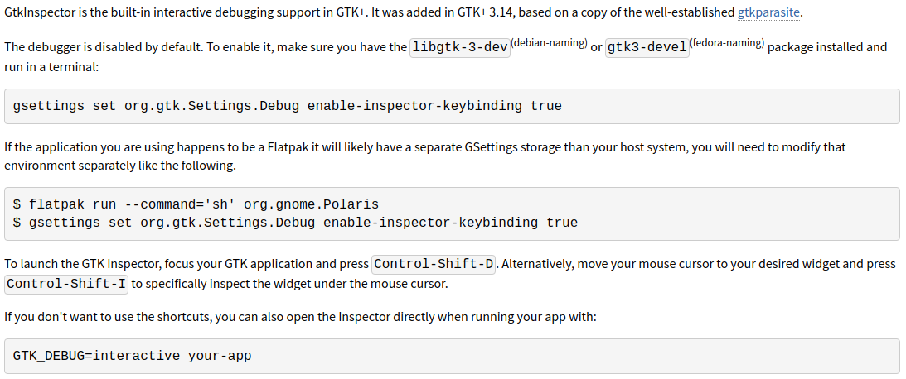

# Tidy

Tidy is a desktop application created to manage the deletion of all those local branches that have been already merged into a target branch.

So this is a little tool i built in order to keep my local repository clean, since the current workflow in my job is to create a branch per feature and afterwards merge the aforementioned branch into a development branch, we end up having lots of branches laying around in the local repository which is not good.

All you need to do is to add some configuration, in the settings section you have to provide where in the filesystem is laying your repository along with the target branch you wish to know your branches were merged to.

    

<table border="0" cellspacing="0" cellpadding="0" style="border-collapse: collapse; border: none;">
  <tr>
    <td></td>
    <td></td>
    <td></td>
    <td></td>
    <td></td>
  </tr>
</table>

Gtkinspector is a tool which allow us to inspect all aspects of gtk windows, it's really useful for desktop apps development. It helped me to add custom styling to the gtk windows just with plane css.

  

Currently in development **

## Contributing
Pull requests are welcome. For major changes, please open an issue first to discuss what you would like to change.

## :pushpin: License

This project is licensed under the MIT License - see the [LICENSE.md](LICENSE.md) file for details

MADE WITH ❤ BY ABRAHAM

